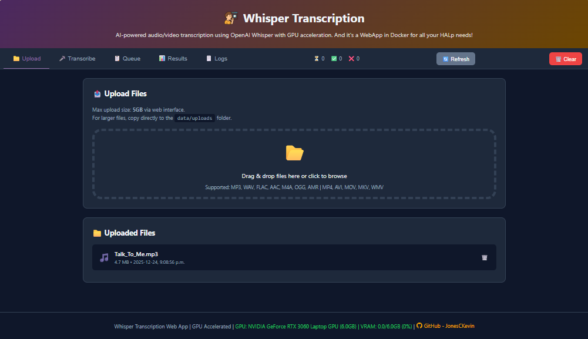
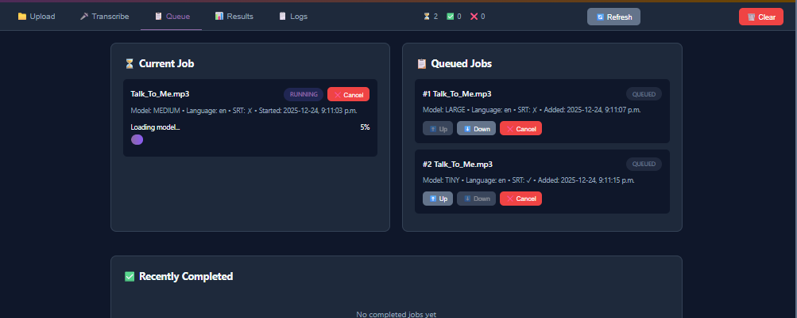
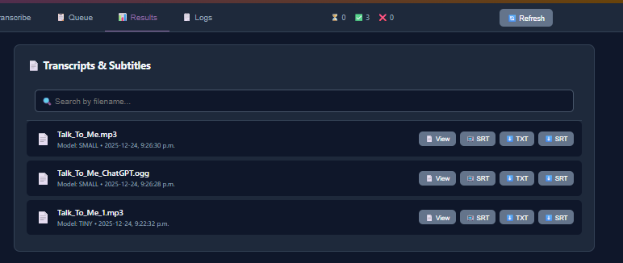

# Whisper Transcription Tool


[DockerHub - Jonesckevin](https://hub.docker.com/r/jonesckevin/whisper-webapp)

AI-powered audio/video transcription using OpenAI Whisper with GPU acceleration. And it's a WebApp in Docker for all your HALp needs!





## Quick Start

**Choose Your Version:**
- **Local CLI:** `.\run_whisper.ps1` (Windows) or `python src/audio_to_text4.py input.mp4`
- **Docker Web:** `.\start-docker.ps1` → option 1 → http://localhost:8080
- **Docker CLI:** `.\start-docker.ps1` → option 2 (batch processing)
- **DockerHub:** 
    ```bash
    docker run -d \
      --name whisper-webapp \
      -p 8000:5000 \
      -v "$(pwd)/data/uploads:/data/uploads" \
      -v "$(pwd)/data/completed:/data/completed" \
      -v "$(pwd)/data/models:/root/.cache/whisper" \
      -e NVIDIA_VISIBLE_DEVICES=all \
      -e CUDA_VISIBLE_DEVICES=0 \
      -e FLASK_ENV=production \
      -e MAX_UPLOAD_SIZE_GB=5 \
      -e PRELOAD_WHISPER_MODELS=false \
      --gpus '"device=0"' \
      --restart unless-stopped \
      jonesckevin/whisper-webapp:latest
  ```

| Task | Command |
|------|---------|
| **Transcribe one file** | `python src/audio_to_text4.py video.mp4 --srt` |
| **Transcribe with large model** | `python src/audio_to_text4.py audio.mp3 -m large --srt` |
| **Batch transcribe all** | `python src/audio_to_text4.py --transcribe-all --batch-model base` |
| **Spanish transcription** | `python src/audio_to_text4.py audio.mp3 --language es` |
| **Extract audio only** | `python src/audio_to_text4.py video.mp4 --convert-only --audio-format mp3` |
| **Web UI (multi-user)** | `.\start-docker.ps1` → select 1 → http://localhost:8080 |
| **Docker batch process** | `.\start-docker.ps1` → select 2 |

---
## Docker Web Features

**Access:** http://localhost:8080 after running `.\start-docker.ps1` → option 1

- 📤 **Upload:** Drag & drop files (max 5GB via web, unlimited via network share)
- 📋 **Queue:** View pending jobs, reorder priority with ↑↓ arrows
- 📊 **Progress:** Real-time transcription progress with percentage
- 🔄 **Refresh:** Detect files added to `data/uploads/` via network share
- 📁 **Results:** Download transcripts/SRT, view in browser, manual delete

**Network Share Directories:**
- `data/uploads/` - Input files (no size limit when copied directly)
- `data/completed/` - Output transcripts and SRT files

---

## Command Reference

### Combined Command Table

| Switch/Argument | PowerShell (run_whisper.ps1) | Linux/Mac (start-docker.sh) | Python (audio_to_text4.py) | Description |
|-----------------|------------------------------|----------------------------|----------------------------|-------------|
| **(no args)** | ✅ Interactive menu | ✅ Interactive menu | ❌ Required: input file | Launch interactive mode |
| `input.mp4` | N/A | N/A | ✅ `input.mp4` | Input audio/video file path |
| `-o output.txt` | N/A | N/A | ✅ `-o output.txt` | Specify output file path |
| `--srt` | ✅ Prompted in menu | N/A | ✅ `--srt` | Generate SRT subtitle file |
| `-m MODEL` | ✅ Prompted in menu | N/A | ✅ `-m large` | Select model (tiny/base/small/medium/large) |
| `--language LANG` | N/A | N/A | ✅ `--language es` | Force specific language (auto-detect by default) |
| `--transcribe-all` | N/A | N/A | ✅ `--transcribe-all` | Batch process all files in holding/audio/ |
| `--batch-model MODEL` | N/A | N/A | ✅ `--batch-model base` | Model for batch transcription |
| `--convert-only` | N/A | N/A | ✅ `--convert-only` | Extract audio without transcribing |
| `--audio-format mp3` | N/A | N/A | ✅ `--audio-format mp3` | Audio format for conversion |
| `--organize` | N/A | N/A | ✅ `--organize` | Sort files into audio/video folders |
| `-Mode web` | N/A | N/A | N/A | (Docker only) Launch web UI |
| `-Mode cli` | N/A | N/A | N/A | (Docker only) Batch CLI mode |
| `-Mode build` | N/A | N/A | N/A | (Docker only) Build image without running |
| `-Model medium` | N/A | N/A | N/A | (Docker only) Skip model selection prompt |

### Environment Variables (Docker)
| Variable | Example | Description |
|----------|---------|-------------|
| `NVIDIA_VISIBLE_DEVICES` | `all` or `0` | Specify which GPUs to use (all or specific IDs) |
| `CUDA_VISIBLE_DEVICES` | `0` | Specify which CUDA devices to use | |
| `FLASK_ENV` | `production` | Set Flask environment (production/development) |
| `MAX_UPLOAD_SIZE_GB` | `5` | Max upload size in GB for web UI |
| `PRELOAD_WHISPER_MODELS` | `true` | Preload all Whisper models on startup (true/false) |

### PowerShell Launcher (run_whisper.ps1)

| Usage | Description |
|-------|-------------|
| `.\run_whisper.ps1` | Interactive menu for model selection, SRT generation, and transcription |
| Auto-setup | Creates virtual environment, installs dependencies, checks GPU/CUDA |
| GPU detection | Offers to install PyTorch with CUDA support if GPU detected |

### Docker Launcher (start-docker.ps1 / start-docker.sh)

| Option | Command | Description |
|--------|---------|-------------|
| **Web Mode** | Select `1` from menu | Multi-user web UI at http://localhost:8080 |
| **CLI Mode** | Select `2` from menu | Batch process files from data/uploads/ |
| **Build Only** | Select `3` from menu | Build Docker image without running |
| **Stop** | Select `4` from menu | Stop and remove containers |
| **Direct Web** | `.\start-docker.ps1 -Mode web` | Launch web mode without menu |
| **Direct CLI** | `.\start-docker.ps1 -Mode cli -Model medium` | Launch CLI with specific model |

### Python Script (audio_to_text4.py)

| Switch | Example | Description |
|--------|---------|-------------|
| **(required)** | `python src/audio_to_text4.py input.mp4` | Input audio/video file |
| `-o, --output` | `-o transcript.txt` | Specify output file path |
| `-m, --model` | `-m large` | Whisper model (tiny/base/small/medium/large) |
| `--srt` | `--srt` | Generate SRT subtitle file alongside transcript |
| `--language` | `--language es` | Force language (en, es, fr, de, etc.) |
| `--transcribe-all` | `--transcribe-all --batch-model base` | Batch process all files in holding/audio/ |
| `--batch-model` | `--batch-model medium` | Model to use for batch processing |
| `--convert-only` | `--convert-only --audio-format mp3` | Extract audio without transcribing |
| `--audio-format` | `--audio-format wav` | Audio format for extraction (mp3/wav/flac) |
| `--organize` | `--organize` | Sort files in holding/ into audio/video folders |

---

## Model Selection

| Model | VRAM | Speed | Quality | Use Case |
|-------|------|-------|---------|----------|
| **tiny** | ~1GB | ⚡⚡⚡⚡⚡ | ⭐ | Quick drafts, testing |
| **base** | ~1.5GB | ⚡⚡⚡⚡ | ⭐⭐ | **Recommended** |
| **small** | ~2.5GB | ⚡⚡⚡ | ⭐⭐⭐ | Better accuracy |
| **medium** | ~4GB | ⚡⚡ | ⭐⭐⭐⭐ | High quality |
| **large** | ~5.5GB | ⚡ | ⭐⭐⭐⭐⭐ | Best quality |

**GPU Acceleration:** 15-30x faster with NVIDIA GPU (auto-detected)

**References:** [OpenAI Whisper Models](https://github.com/openai/whisper#available-models) | [Model Card](https://github.com/openai/whisper/blob/main/model-card.md)

---

## File Support

**Audio:** MP3, WAV, FLAC, AAC, M4A, OGG, AMR  
**Video:** MP4, AVI, MOV, MKV, FLV, WMV  
**Output:** `.txt` transcripts with timestamps, `.srt` subtitles (optional)

---

## Troubleshooting

| Issue | Solution |
|-------|----------|
| **GPU not detected (Local)** | Run `.\run_whisper.ps1` and answer 'Y' when prompted to install PyTorch with CUDA |
| **GPU not detected (Docker)** | Install nvidia-docker2: `sudo apt-get install nvidia-docker2 && sudo systemctl restart docker` |
| **Large file upload fails** | Files >5GB must be copied to `data/uploads/` instead of web upload |
| **Files not appearing in web UI** | Click 🔄 Refresh button to detect network share files |
| **Out of VRAM** | Use smaller model or reduce GPU usage elsewhere |
| **FFmpeg not found** | Local CLI auto-installs, Docker includes FFmpeg |

---

## Directory Structure

| Path | Purpose |
|------|---------|
| `run_whisper.ps1` | Local CLI launcher (Windows) |
| `start-docker.ps1` | Docker launcher (Windows) |
| `start-docker.sh` | Docker launcher (Linux/Mac) |
| `src/audio_to_text4.py` | Main transcription script |
| `app/` | Flask web application |
| `data/uploads/` | Input files (network share accessible) |
| `data/completed/` | Output transcripts and SRT files |
| `holding/audio/` | Local CLI input directory |
| `holding/video/` | Local CLI video input directory |

---

## Support

- **GPU Status:** Check web UI footer or run `nvidia-smi`
- **Docker Logs:** `docker logs whisper-webapp`
- **Issues:** Report with error messages and GPU model info

